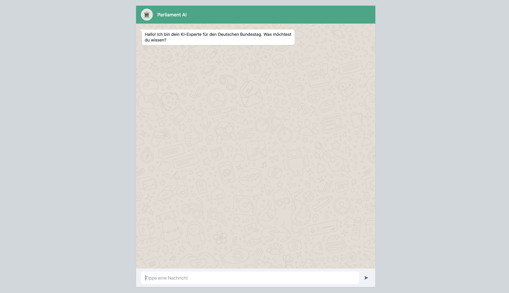
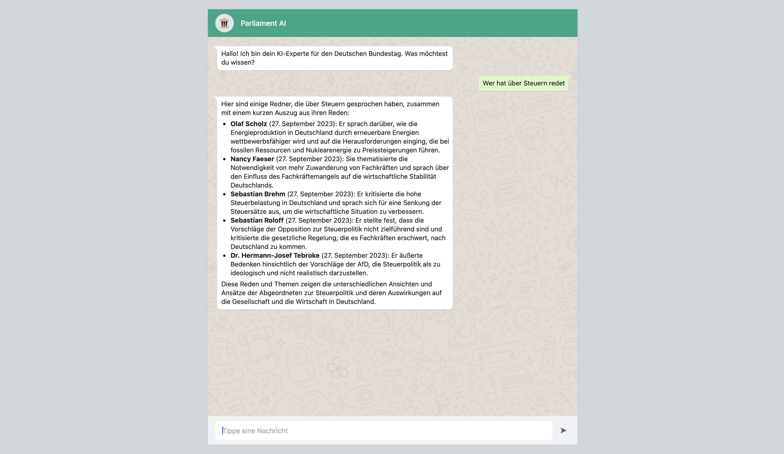

# Parliamentary Protocol Parser & Advanced GraphRAG Assistant

A Java application for parsing XML protocols from the German Bundestag, loading them into an embedded Neo4j graph database, and enabling highly contextual, natural-language querying via an advanced GraphRAG (Retrieval-Augmented Generation) pipeline.

---

## Table of Contents

- [Overview](#overview)
- [Key Features](#key-features)
- [The GraphRAG Architecture](#the-graphrag-architecture)
- [Project Structure](#project-structure)
- [Getting Started](#getting-started)
- [Execution Workflow](#execution-workflow)
- [Graph Analytics & Statistics](#graph-analytics--statistics)
- [Known Data Issues](#known-data-issues)

---

## Overview

This project processes 214 XML protocol files from German Bundestag parliamentary sessions. It extracts structured information about sessions, speakers, speeches, and interjections, and loads everything into an embedded Neo4j graph database.

Beyond standard data ingestion, this application serves as an **Advanced AI GraphRAG system**. By combining OpenAI's vector embeddings with Neo4j's relational graph traversals, the AI assistant doesn't just read isolated text snippets — it understands the political context, the timeline, the speaker's party affiliation, and the real-time reactions (heckling/comments) from the parliament floor.

---

## Key Features

| Feature | Description |
|---|---|
| **Advanced GraphRAG** | Custom LangChain4j integration that combines semantic vector search with Cypher graph traversals for highly accurate AI answers. |
| **Graph Network Analytics** | Calculates Degree Centrality, implicitly detects cross-party interaction networks, and traces topic evolution over time. |
| **Embedded Graph Database** | Runs Neo4j locally with an explicitly enabled Bolt Connector (Port 7687) to support direct AI retrieval. |
| **Robust XML Parsing** | DOM-based parser with duplicate detection, caching, and error handling. |
| **High Performance** | Batch operations via `UNWIND` and `MERGE` ensure idempotent, atomic data loading. |

---

## The GraphRAG Architecture

Unlike standard RAG pipelines that only pass raw text chunks to an LLM, this application uses a **Hybrid GraphRAG** approach to provide the AI with deep structural context.

### How the Pipeline Works

1. **Vector Ingestion:** Speeches are converted to 1536-dimensional vector embeddings using OpenAI (`text-embedding-ada-002`) and stored in a Neo4j Vector Index with their unique `redeId` as metadata.

2. **Semantic Search:** When a user asks a question (e.g., *"How did the CDU/CSU leadership position themselves on economic policy before 2025?"*), the system embeds the query and fetches the top 3 most semantically relevant speeches.

3. **Graph Traversal (The Secret Sauce):** A custom `GraphRAGRetriever` intercepts the matches. Using the matched `redeId`, it executes a native Cypher query to traverse the surrounding graph:
    - `(r:Rede)-[:GEHALTEN_IN]->(s:Sitzung)` → Extracts the exact **Date**.
    - `(redner:Redner)-[:HAT_GESPROCHEN]->(r:Rede)` → Extracts the **Speaker Name** and **Party** (`Fraktion`).
    - `(r:Rede)-[:BEINHALTET]->(k:Kommentar)` → Extracts any **Interruptions/Heckling** shouted during that specific speech.

4. **Context Assembly & Generation:** The retrieved text, alongside its rich graph context, is formatted into a "Protocol Excerpt" and sent to the LLM (`gpt-3.5-turbo` / `gpt-4o`). The resulting AI answer is highly accurate, context-aware, and immune to typical RAG hallucinations.

---

## Project Structure

```
org.texttechnologylab.ppr/
├── Main.java                   # App entry point (Coordinates Parsing, DB, Analytics, AI)
├── AppFactory.java             # Singleton factory for services
├── parser/
│   └── XMLParser.java          # DOM-based XML parser with caching
├── chatbot/
│   ├── RagService.java         # Initializes embeddings, vector store, and AI services
│   ├── GraphRAGRetriever.java  # Custom LangChain4j Retriever executing Cypher traversals
│   └── ParliamentAssistant.java # AI Agent interface with System Prompts
├── model/
│   ├── interfaces/             # Data model contracts (Sitzung, Rede, Redner, etc.)
│   └── *.Impl.java             # Concrete implementations providing toNode() logic
└── db/
    ├── DatabaseConnection.java
    └── Neo4jConnection.java    # Neo4j implementation (Embedded + Bolt + Graph Algorithms)
```

---

## Getting Started

### Prerequisites

- Java 21 (JDK)
- Apache Maven
- Neo4j 5.13.0 (included as a Maven dependency)
- OpenAI API Key (**required** for the RAG Assistant)

### Build & Run

1. Place your XML protocol files in `src/main/resources/`.

2. Export your OpenAI key to your environment:

```bash
export OPENAI_API_KEY="sk-your-api-key-here"
```

3. Build and run the application:

```bash
mvn clean package
mvn exec:java -Dexec.mainClass="org.texttechnologylab.ppr.Main"
```

The embedded Neo4j database is created automatically at `target/neo4j-db`. The application will process the data, print the graph analytics to the console, and immediately drop you into the interactive Parliament AI Chat.

---

## Execution Workflow

1. **Parse XMLs:** Transforms XML files into Java objects, detecting duplicates and caching speakers.
2. **Start Database:** Initializes the embedded Neo4j instance and opens the Bolt port (7687) for LangChain4j.
3. **Load Graph:** Clears old data, creates constraints, and uses batch Cypher queries (`UNWIND`/`MERGE`) to load nodes and relationships.
4. **Run Analytics:** Executes statistical and advanced graph network algorithms.
5. **Start GraphRAG AI:** Embeds speeches into the Vector Store and starts the interactive CLI chat loop.

---

## Demo


